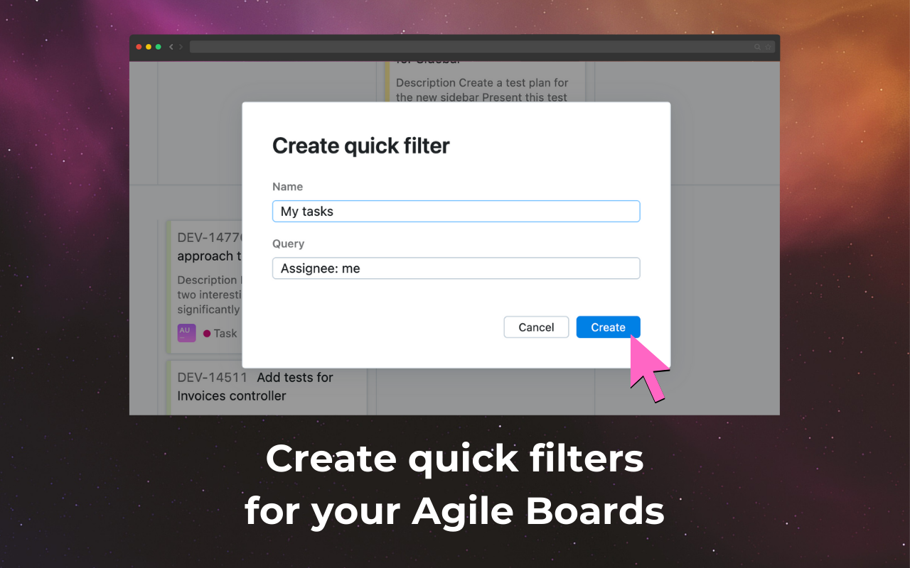

# YouTrack Quick Filters

[](https://chromewebstore.google.com/detail/iaddgmcajdiblafjfhloadmphkbplddo)

Add quick filter buttons to YouTrack Agile Boards — just like Jira has had for years.

👉 [Install from Chrome Web Store](https://chromewebstore.google.com/detail/iaddgmcajdiblafjfhloadmphkbplddo)

---

## ✨ Features

- Create and manage your own quick filters (e.g. by assignee, state, or any search query).
- Apply them with a single click — no need to type search strings every time.
- Edit, duplicate, or remove filters via a clean UI.
- Seamlessly integrated into YouTrack Agile Boards.

This extension brings a long-requested feature (see JetBrains request [JT-38623](https://youtrack.jetbrains.com/issue/JT-38623)) directly into YouTrack.

---

## 📸 Screenshots




---

## 🚀 Installation

1. Get the extension from the [Chrome Web Store](https://chromewebstore.google.com/detail/iaddgmcajdiblafjfhloadmphkbplddo).
2. Open any Agile board in YouTrack.
3. Start adding and using your own quick filters!

---

## 🛠 Development

Clone the repo:

```bash
git clone https://github.com/ausievich/yt-quick-filters.git
cd yt-quick-filters
```
Load the extension manually:

1. Open `chrome://extensions/`
2. Enable **Developer mode**
3. Click **Load unpacked** and select this repo folder

---

## 🙌 Motivation

- Jira has had quick filters for ages ([docs](https://support.atlassian.com/jira-service-management-cloud/docs/create-quick-filters-for-your-board/)).
- YouTrack users have been requesting the same feature for almost 10 years:
    - [YouTrack support forum thread](https://youtrack-support.jetbrains.com/hc/en-us/community/posts/115000751664-Agile-board-Quick-Filters)
    - [Feature request in YouTrack itself](https://youtrack.jetbrains.com/issue/JT-38623/)

So I decided to just build it myself 🙂

---

## 🤝 Contributing

Contributions are welcome!  
If you’d like to improve styles, fix bugs, or add new features:

1. Fork the repo
2. Create a feature branch (`git checkout -b feature/my-feature`)
3. Commit your changes (`git commit -m "Add my feature"`)
4. Push to your fork and open a Pull Request

Please try to keep code style consistent and test your changes locally before PR.

---

## 📄 License

MIT

